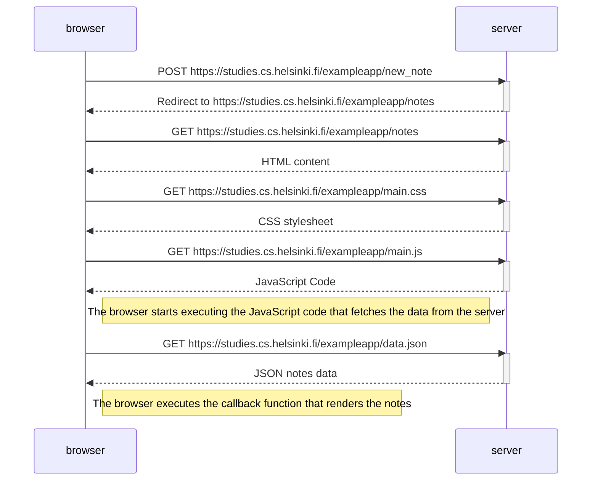
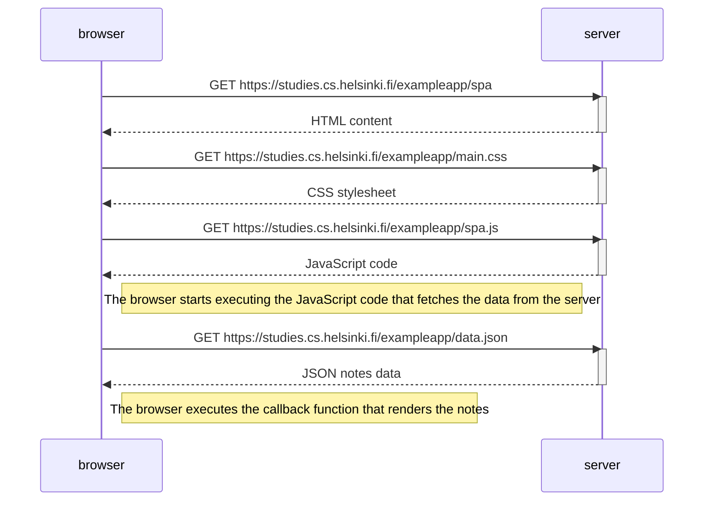
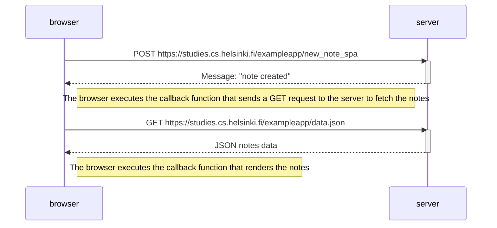

# Part 0

## 0.4 New note diagram

```mermaid
sequenceDiagram
participant browser
participant server

    browser ->> server: POST https://studies.cs.helsinki.fi/exampleapp/new_note
    activate server
    server -->> browser: Redirect to https://studies.cs.helsinki.fi/exampleapp/notes
    deactivate server

    browser ->> server: GET https://studies.cs.helsinki.fi/exampleapp/notes
    activate server
    server -->> browser: HTML content
    deactivate server

    browser->>server: GET https://studies.cs.helsinki.fi/exampleapp/main.css
    activate server
    server-->>browser: CSS stylesheet
    deactivate server

    browser->>server: GET https://studies.cs.helsinki.fi/exampleapp/main.js
    activate server
    server-->>browser: JavaScript Code
    deactivate server

    Note right of browser: The browser starts executing the JavaScript code that fetches the data from the server

    browser ->> server: GET https://studies.cs.helsinki.fi/exampleapp/data.json
    activate server
    server -->> browser: JSON notes data
    deactivate server
    
    Note right of browser: The browser executes the callback function that renders the notes
```

## 0.5 SPA diagram

```mermaid
sequenceDiagram
participant browser
participant server

    browser ->> server: GET https://studies.cs.helsinki.fi/exampleapp/spa
    activate server
    server -->> browser: HTML content
    deactivate server
    
    browser ->> server: GET https://studies.cs.helsinki.fi/exampleapp/main.css
    activate server
    server -->> browser: CSS stylesheet
    deactivate server
    
    browser ->> server: GET https://studies.cs.helsinki.fi/exampleapp/spa.js
    activate server
    server -->> browser: JavaScript code
    deactivate server

    Note right of browser: The browser starts executing the JavaScript code that fetches the data from the server
    
    browser ->> server: GET https://studies.cs.helsinki.fi/exampleapp/data.json
    activate server
    server -->> browser: JSON notes data
    deactivate server
    Note right of browser: The browser executes the callback function that renders the notes
```

## 0.6 New note diagram (SPA)

```mermaid
sequenceDiagram
participant browser
participant server

    browser ->> server: POST https://studies.cs.helsinki.fi/exampleapp/new_note_spa
    activate server
    server -->> browser: Message: "note created"
    deactivate server
    
    Note right of browser: The browser executes the callback function that sends a GET request to the server to fetch the notes
    
    browser ->> server: GET https://studies.cs.helsinki.fi/exampleapp/data.json
    activate server
    server -->> browser: JSON notes data
    deactivate server
    
    Note right of browser: The browser executes the callback function that renders the notes
```